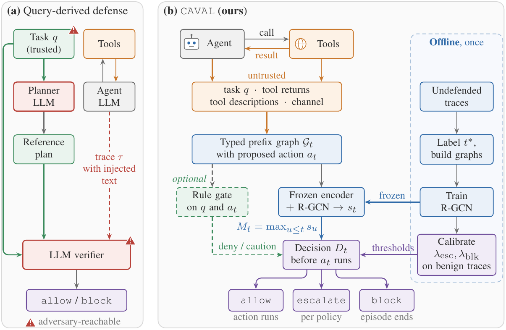
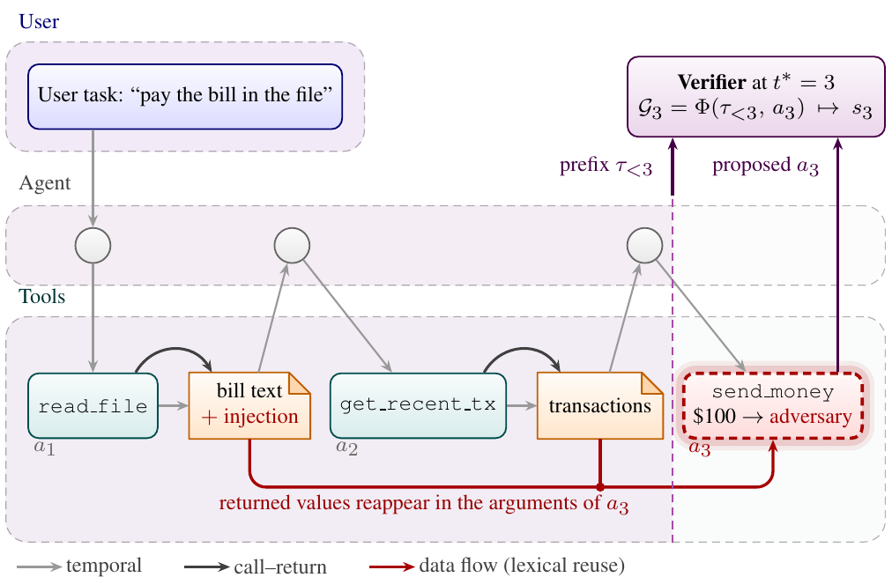

<div align="center">

# CAVAL : **Calibrated Action Verification for Autonomous LLM agents**

Official implementation of *CAVAL: Calibrated Runtime Action Verification for LLM Agents without a Trusted Runtime Reference*

[](https://www.python.org/)
[](https://pytorch.org/)
[](https://pyg.org/)
[](https://docs.astral.sh/uv/)
[](https://github.com/ethz-spylab/agentdojo)
[](https://github.com/SaFo-Lab/AgentDyn)
[](LICENSE)


</div>

CAVAL is a runtime verifier for tool-calling LLM agents. Before each proposed action executes, it scores a typed graph
of the execution so far, from the user task to the proposed action, with a relational graph convolutional network
(R-GCN) over frozen text embeddings. Split conformal calibration on benign traces sets the intervention threshold on the
running maximum of the scores, which bounds the probability of a first false alarm on a benign trace under
exchangeability. The user task enters the graph as one untrusted event, not as a reference for allowed behavior, and
no generative model takes part in the decision.

<p align="center">
  <br>
  <em>Overview. Offline, the scorer is trained on undefended traces labeled at the first compromising action t*, and the
  thresholds are calibrated on benign traces. Online, each proposed action is scored from the prefix graph before it runs.</em>
</p>

<p align="center">
  <br>
  <em>Example. An injected instruction in a bill leads the agent to propose a transfer to the adversary. The completed
  events and the proposed action form a typed graph with temporal, call&ndash;return, and data-flow edges.</em>
</p>

## Highlights

- **Verification before execution.** Each proposed action is scored from the execution prefix inside the agent
  harness, before the tool runs.
- **No trusted task, no LLM judge.** The decision uses a 43K-parameter R-GCN over frozen MiniLM embeddings, with no
  generative-model call.
- **Calibrated interventions.** Thresholds come from split conformal calibration on benign traces, and conformal risk
  control bounds expected benign disruption.
- **Recovery.** After an intervention, CAVAL can reject the action, remove the tool returns that fed it, and let the
  agent continue.
- **Results from the released runs.** The paper's tables and figures regenerate from the released episode logs in about
  two minutes on a CPU, and `tests/test_paper_numbers.py` compares the values with the paper.

## Installation

Requires Python 3.10 and [uv](https://docs.astral.sh/uv/).

```bash
git clone https://github.com/annonyMss/caval.git && cd caval
uv sync                          # creates .venv from pyproject.toml and uv.lock
bash scripts/download_data.sh    # downloads the data archive (237 MB), checks it, and unpacks data/ (about 1.2 GB)
```

The data (episode logs, training corpus and the copy of AgentDyn) is attached to the
[v1.0.0.1 release](https://github.com/annonyMss/caval/releases/tag/v1.0.0.1) as `caval_data.tar.gz`, because it exceeds
GitHub's size limit for repository files. The script downloads it from there; downloading it by hand and running
`tar -xzf caval_data.tar.gz` in the repository root gives the same result.

The MiniLM encoder (`sentence-transformers/all-MiniLM-L6-v2`) downloads on first use. A GPU is optional.

## Quick start: regenerate the results

```bash
bash scripts/reproduce_paper_results.sh      # results/*.json, results/*.csv, results/figures/*.pdf
uv run python tests/test_paper_numbers.py    # compares the regenerated values with the paper
```

No model is called and nothing is trained.

## Rebuild the corpus and retrain

```bash
bash scripts/build_training_corpus.sh        # data/corpus/: trace graphs, content embeddings, action labels
bash scripts/train_offline_models.sh         # results/offline/ and results/checkpoints/ (GPU recommended)
```

The released `results/offline` files and the five scorers in `results/checkpoints` are the ones the paper reports.
Retraining reproduces them up to GPU nondeterminism.

## Run the agent online

```bash
echo "OPENAI_API_KEY=..." > .env
RUN_SUFFIX=_rerun1 bash scripts/run_caval_five_scorers.sh   # CAVAL, deployed configuration, five scorers, seven suites
RUN_SUFFIX=_rerun1 bash scripts/run_undefended_draws.sh     # the undefended agent, five draws
```

| Launcher | Runs |
|---|---|
| `scripts/run_caval_one_scorer.sh` | one scorer at any budget, with stop or recovery, using the learned scorer, the rules, or both |
| `scripts/run_verifier_directed_attack.sh` | injections that address the verifier, against CAVAL, the undefended agent, or DRIFT |
| `scripts/run_adversary_knowledge_variants.sh` | injections with the user and model names removed or wrong |
| `scripts/run_baseline_defenses.sh`, `scripts/count_baseline_tokens.sh` | the tool filter, Progent and CaMeL in AgentDyn's harness, and their token counts |
| `src/experiments/score_aware_attack.py` | the attack that rewrites the injection from the verifier's score |

The harness skips episodes already on disk, so `RUN_SUFFIX` writes a new run next to the released one (for example
`caval_deployed_rerun1_scorer1`), and the read-outs take the new run name in place of the released one. The agent is
GPT-4o-mini (`gpt-4o-mini-2024-07-18`) at the API default temperature, so each online run is a new draw whose values
vary around those in the paper. The released episode logs are the record of the runs the paper reports.

## Repository layout

```
src/caval/           the verifier: execution graph, scorer, runtime decisions
src/corpus/          training corpus: trace graphs and compromise-step labels
src/experiments/     scorer training and the score-aware attack
src/agent_harness/   online runs (harness adapted from DRIFT)
src/analysis/        tables and figures of the paper
scripts/             launchers and the reproduce, build and train scripts
tests/               unit tests and the paper-number check
results/             scorers, offline results, read-outs and figures
data/                corpus, episode logs and AgentDyn (from caval_data.tar.gz)
```

## Citation

The citation will be added after the review period.

## License and acknowledgments

This repository is provided for review only; see [LICENSE](LICENSE). An open-source license will be applied when the work
is published. The agent harness in `src/agent_harness` is adapted from [DRIFT](https://github.com/SaFo-Lab/DRIFT) and
keeps its MIT license (`src/agent_harness/LICENSE_DRIFT`), and builds on [AgentDojo](https://github.com/ethz-spylab/agentdojo).
`data/benchmarks/AgentDyn` keeps the MIT license of [AgentDyn](https://github.com/SaFo-Lab/AgentDyn) and contains the runs
released with it, together with our runs of the tool filter, Progent and CaMeL on the AgentDojo suites in its harness.
